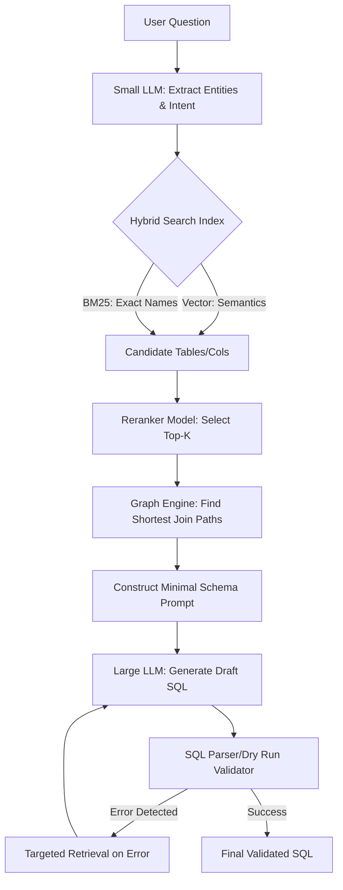

# Scalable Text-to-SQL Architecture Design

## 1. Diagnosing the 40K Token Problem
The `D.strict.jsonl` logs reveal that your current prompt size isn't just 40K tokens—it often reaches **130K to 230K tokens**. 
This explosion is caused by an O(DB_SIZE) architectural approach: dumping the entire database context into the prompt. 

**Where are the tokens going?**
1. **Schema DDLs & Column Descriptions (60%)**: Sending all 100+ tables, even when the query only needs 2.
2. **Semantic Layer & Business Rules (15%)**: Passing the entire catalog of metrics and dimensions.
3. **Foreign Keys & Relationships (10%)**: Exhaustive lists of how every table connects to every other table.
4. **Examples / Few-shot SQL (10%)**: Passing a static, large set of example queries.
5. **System Instructions (5%)**: Prompt instructions, dialects, and rules.

**Target Token Budget (~4K Tokens per query):**
- System Instructions: ~500 tokens
- User Question: ~100 tokens
- Retrieved Semantic Concepts / Metadata: ~300 tokens
- Schema (Filtered to Top-K Tables): ~500–1,000 tokens
- Columns (Filtered to Top-K within Tables): ~500–1,500 tokens
- Relevant Joins/Relationships: ~300–500 tokens
- Targeted Examples (Top 2): ~500 tokens

To achieve this, we must **stop explaining the database to the LLM** and instead **retrieve only what is strictly necessary.**

---

## 2. Challenging the Current Architecture
The current pipeline `User Question → Gather ALL Context → LLM → SQL` fundamentally misunderstands the role of the LLM. It uses the LLM as a search engine, semantic matcher, and query engine simultaneously.

**The Paradigm Shift:** Intelligence must move *outside* the LLM. 
The LLM should only be the **final SQL translation engine**. Candidate selection, entity matching, table filtering, and join path discovery should be handled by deterministic code, vector indexes, and graph algorithms. 

---

## 3. Retrieval Strategies

### A. Vector Search / Embeddings
* **Appropriate for**: Mapping ambiguous user terms ("revenue from premium users") to canonical semantic concepts, column descriptions, and finding structurally similar few-shot examples.
* **Inappropriate for**: Table selection (lexical overlap matters more than semantic similarity for exact names), Join discovery (vectors cannot reason about foreign key constraints).
* **Limitation**: Pure vector search suffers from "out of vocabulary" problems with specific IDs or acronyms, and it doesn't understand table schemas as bounded entities.

### B. Graph-Based Retrieval
* **Appropriate for**: Join path discovery and relationship extraction.
* **Mechanism**: Once candidate tables are identified via search, use shortest-path (Dijkstra/BFS) over a pre-computed graph of Foreign Keys to extract the exact `JOIN` clauses needed. 
* **Verdict**: Essential. This reduces the relationship context from "all foreign keys" to "just the path connecting Table A to Table B."

### C. Hybrid Retrieval
* **Mechanism**: Vector Search (for semantics/descriptions) + BM25/Lexical Search (for exact column/table names).
* **Verdict**: Mandatory. Pure vector search will fail on exact keyword matches (e.g., matching a specific customer ID or weird acronym).

### D. Hierarchical Retrieval
* **Mechanism**: Retrieve Domains/Schemas → Retrieve Tables within those Schemas → Retrieve Columns within those Tables.
* **Verdict**: Highly recommended. It acts as a funnel, aggressively pruning the search space at each level.

### E. Query Decomposition
* **Mechanism**: Break "Show sales in US for Q3" into `[Metric: Sales, Dimension: Region=US, Time: Q3]`. 
* **Verdict**: Essential for large semantic layers. Use a fast, small, local model (or cheap LLM like Claude Haiku) to extract these entities, then retrieve only the exact tables required for those entities.

### F. Semantic Layer Optimization
* **Mechanism**: Instead of storing massive descriptions, compile the semantic layer into a searchable index (Vector + BM25). Store only IDs and short tags.

---

## 4. Retrieve → Generate → Validate → Retrieve Again
This is the **most powerful paradigm** for token reduction.
1. **Initial Retrieval**: Aggressively small (e.g., 2 tables, 10 columns).
2. **First Draft SQL**: LLM attempts generation.
3. **Validation**: Run the SQL through a parser (e.g., `sqlglot` or a database `EXPLAIN` / `DRY PLAN` tool like the ones in your logs).
4. **Correction**: If it fails ("Column 'x' not found"), *retrieve the specific metadata for 'x'* and pass ONLY the error and the targeted correction context back to the LLM.
**Verdict**: This turns a 40K token prompt into a 3K token prompt followed by a 1K token correction prompt.

---

## 5. SQL-Aware Retrieval
Using a small LLM or parser to predict the *structure* of the SQL (e.g., identifying that the query requires a `GROUP BY` on a time column) allows you to retrieve only time-dimension metadata. This is highly effective but complex to build. A simpler query intent classifier is preferred.

---

## 6. Caching
The largest scalability gains come from:
1. **Semantic retrieval cache**: Caching the mapping of `User Term → Table/Column ID`.
2. **Join-path cache**: The shortest path between `Orders` and `Customers` is static. Cache the graph traversal.
3. **Question-level cache**: Exact or highly semantically similar questions should bypass the LLM entirely.

---

## 7. Query Routing
Different queries require different pipelines:
* **Metric/Dashboard query**: Route to the semantic layer API, bypass SQL generation.
* **Lookup query**: Route to BM25 table search.
* **Complex join query**: Route through full Graph retrieval.
Lightweight classifiers (local NLP or fast LLMs) routing queries saves massive amounts of latency and tokens.

---

## 8. Small Model + Large Model Architecture
* **Small Model (Haiku/GPT-4o-mini/Llama-3-8b)**: Entity extraction, intent detection, schema ranking. (Cost: pennies, Latency: ms).
* **Large Model (Opus/GPT-4/Sonnet-3.5)**: Final SQL generation. (Cost: dollars, Context: minimal).
**Verdict**: Crucial for cost and latency at scale.

---

## 9. Top-K Dynamic Retrieval
Fixed K is a trap. 
* Stop retrieval when confidence > 0.85, OR when all extracted entities from the user query have been successfully mapped to database columns.
* This ensures a simple `SELECT COUNT(*)` gets 1 table, while a complex cross-domain query gets 5.

---

## 10. Confidence-Based Retrieval & Re-ranking
Use a cross-encoder (e.g., `BGE-Reranker`) to re-score the retrieved tables/columns before sending them to the LLM. Cross-encoders are slow over large datasets but highly accurate for re-ranking the top 20 results from a hybrid search down to the top 3.

---

## 11. Database Statistics
* **Expose to LLM**: Enums (for low cardinality columns), Date ranges, and specific distinct values *only if* the user asked for a specific string (e.g., user asks for "Acme Corp", send the LLM the exact DB spelling `ACME Corporation`).
* **Keep Outside**: Null percentages, index metadata, page sizes. These belong in the retrieval/ranking algorithm, not the prompt.

---

## 12. Example SQL Retrieval
Instead of 50 static examples, embed the ASTs or SQL queries into a vector database. Retrieve the top 2 examples whose questions are most semantically similar to the user's question. This drops token usage from 10K to 500.

---

## 13. SQL AST / Template Approaches
Constraining the LLM to output a JSON representation of an AST (which is then compiled to SQL) reduces syntax hallucinations but doesn't necessarily solve the schema context size problem. It's helpful, but secondary to retrieval.

---

## 14. "Compilation" of the Database
**This is the core solution.** 
You must treat the database schema like source code that gets compiled into an index:
1. Extract Schema → 2. Build Foreign Key Graph → 3. Embed Column Descriptions → 4. Build Lexical Index of Column Names → 5. Pre-compute common join paths.
When a query arrives, you query the *index*, not the raw schema.

---

## 15. Theoretical Scalability
* **Architecture A (Current)**: LLM context ∝ database size. (Fails at 100 tables).
* **Architecture B (Target)**: LLM context ∝ complexity of the user's question (Number of entities + Number of joins). 
By using an offline index and targeted retrieval, a 1,000-table database takes the *same amount of LLM context* as a 10-table database for a query that only touches 2 tables.

---

## 16. Token Budget Design (Target Ranges)
| Query Type | System/User | Schema (Tables+Cols) | Graph/Joins | Examples | Total Tokens |
| :--- | :--- | :--- | :--- | :--- | :--- |
| **Simple** (1 table) | 600 | 400 | 0 | 300 | **~1,300** |
| **Medium** (2-3 tables)| 600 | 1,000 | 200 | 400 | **~2,200** |
| **Complex** (4+ tables)| 600 | 2,000 | 600 | 600 | **~3,800** |

**Budget Exceeded Behavior**: If candidate retrieval requires > 5,000 tokens, the system should trigger **Interactive Mode**: ask the user a clarifying question ("Did you mean Revenue from Marketing or Sales?") rather than dumping 10,000 tokens into the LLM.

---

## 17. Architecture Comparison

| Approach | Token Reduction | Accuracy Impact | Complexity | Scalability | Recommended |
| :--- | :---: | :---: | :---: | :---: | :---: |
| Full Schema (Current) | None | Baseline | Low | O(N) - Fails | ❌ No |
| Pure Vector RAG | High | Drops (misses exact names)| Low | O(1) | ❌ No |
| Hierarchical Hybrid | Very High | Increases | High | O(1) | ✅ Yes |
| Graph Retrieval (Joins)| High | Huge Increase | Medium | O(1) | ✅ Yes |
| Iterative / Validation| Massive | Huge Increase | High | O(1) | ✅ Yes |
| Query Routing / Small LLM | High | Neutral | Medium | O(1) | ✅ Yes |

---

## 18. The Recommended Architecture Pipeline



---

## 19. The Role of ChromaDB / RAG
1. **What goes in ChromaDB**: Business definitions, semantic column descriptions, and historical User-Question-to-SQL examples.
2. **What does NOT go in ChromaDB**: The schema DDL, exact table names, foreign key definitions.
3. **Lexical Search (BM25)**: Use for exact table/column name matching and ID lookups.
4. **Graph Database (NetworkX/Neo4j)**: Use for Foreign Keys and join paths.
*Does ChromaDB solve token scalability?* No. It is just one component of the retrieval pipeline. Alone, it causes hallucinations by retrieving semantically similar but structurally unrelated tables.

---

## 20. The Biggest Architectural Mistake
**The Mistake**: Treating Text-to-SQL as a single-prompt LLM task rather than a traditional search-and-retrieval software engineering task.
**Fix it NOW**: Stop writing code that dynamically string-concatenates `CREATE TABLE` statements based on the whole database. Implement a structured metadata abstraction layer immediately before adding any more LLM features.

---

## 21. Implementation Roadmap

* **Phase 1 (Immediate)**: Implement a hard cutoff. Rank tables by simple BM25 overlap with the question and truncate to Top 5. (Tokens drop from 150K to 10K instantly).
* **Phase 2 (Retrieval Optimization)**: Stand up the Hybrid (Vector + Lexical) search for tables and columns.
* **Phase 3 (Graph & Joins)**: Pre-compute the Foreign Key graph. Only inject `JOIN` hints for tables that were retrieved in Phase 2.
* **Phase 4 (Iterative Generation)**: Use the `dry_plan` tool output (from your logs) to catch errors and feed them back for a single correction loop, rather than prompting perfectly the first time.

---

## 22. Concrete Code-Level Changes

**Current Anti-Pattern:**
```python
# BAD: Explodes tokens
schema_str = ""
for table in db.tables:
    schema_str += table.get_ddl()
prompt = f"Answer this: {question}. Schema: {schema_str}"
```

**New Pattern (Pseudocode):**
```python
# 1. Intent & Entity Extraction (Fast Local Model)
entities = extract_entities(question) # e.g. ["workflows", "category", "tasks"]

# 2. Hybrid Retrieval
candidate_tables = hybrid_search(entities, limit=5)
candidate_cols = hybrid_search_columns(entities, candidate_tables)

# 3. Graph Join Discovery
join_paths = graph_db.find_shortest_paths(candidate_tables)

# 4. Minimal Context Construction
minimal_schema = build_minimal_ddl(candidate_cols)
join_hints = format_joins(join_paths)

# 5. Iterative Generation
prompt = build_prompt(question, minimal_schema, join_hints)
sql = llm.generate(prompt)

if not validator.dry_run(sql).is_valid:
    missing_info = validator.get_missing_context()
    targeted_schema = retrieve_specific(missing_info)
    sql = llm.correct(sql, error, targeted_schema)
```

---

## 23. Success Metrics
* **Primary Metric**: `Tokens per Query vs. Database Size Correlation`. (This should drop from r = 0.9 to near r = 0.0).
* **Token Metrics**: Target p50 < 3,000 tokens, p99 < 8,000 tokens.
* **Experiment Design**: 
  1. Test on a database with 10 tables. Measure avg tokens.
  2. Duplicate tables to create a 100-table database.
  3. Run the exact same query benchmark.
  4. **Success criteria**: Token usage on the 100-table DB is less than 1.2x the token usage on the 10-table DB.

---

## 24. Be Very Critical
* **"Just use RAG"**: Flawed. Standard chunk-based RAG destroys schema structure. You cannot chunk a `CREATE TABLE` statement and expect the LLM to understand foreign keys.
* **"Knowledge Graphs (RDF/SPARQL)"**: Overkill. You don't need a massive semantic ontology; you just need a simple directed graph of foreign keys.
* **"Larger Models (Gemini 1.5 Pro 1M / Claude Opus)"**: A trap. Just because you *can* pass 200K tokens (as seen in your logs) doesn't mean you should. It massively increases latency, cost, and "lost in the middle" attention degradation.

---

## 25. FINAL OUTPUT

### A. Root Cause
The system passes the entire database schema, relationships, and metadata into the prompt dynamically, resulting in O(N) token consumption relative to database size. Logs show prompts hitting 150K-200K tokens.

### B. Core Principle
Decouple LLM context from database size by moving intelligence into an offline metadata index and using multi-stage, targeted retrieval. Context size should scale strictly with **query complexity**.

### C. Recommended Architecture
Hybrid Search (Lexical + Vector) for entity mapping → Graph Traversal for join discovery → Minimal Schema Construction → LLM Generation → Validator/Parser → Iterative Correction.

### D. Technologies
* **Vector Store**: Qdrant or Milvus (for semantics).
* **Lexical Index**: Elasticsearch or basic SQLite FTS5 (for exact names).
* **Graph**: NetworkX in Python (in-memory is fine for most schemas).
* **Validator**: `sqlglot` + DB `EXPLAIN` (dry run).

### E. What NOT to Build
Do not build a massive generalized Knowledge Graph (RDF/Ontology). Do not rely on pure chunk-based RAG. Do not try to prompt-engineer your way out of this.

### F. Immediate Code Changes
1. Stop injecting full DDLs.
2. Implement a BM25 top-K table filter today.
3. Stop sending the entire foreign key list; only send keys relevant to the retrieved top-K tables.
4. Truncate few-shot examples to the top 2 most relevant via embeddings.

### G. Target Token Budget
1,500 – 4,000 tokens for >90% of queries.

### H. Scalability Model
The token consumption curve should be completely flat as you scale from 10 to 1,000 tables. It should only spike when a user asks an inherently complex query spanning many domains.

### I. Migration Plan
1. Keep the current LLM prompt but replace the `schema_str` variable with a Top-10 BM25 filtered schema.
2. Introduce Vector search for columns.
3. Introduce the Graph engine for joins.
4. Implement the iterative validation loop.

### J. Final Verdict
> **Can we realistically design the system so that LLM token consumption is primarily proportional to query complexity rather than database/schema size?**

**YES.** By implementing offline indexing (compiling the database) and utilizing Hybrid Retrieval + Graph-based Join discovery, the LLM only receives the exact structural subsets needed for the translation task. This completely breaks the linear scaling relationship between database size and prompt size.
